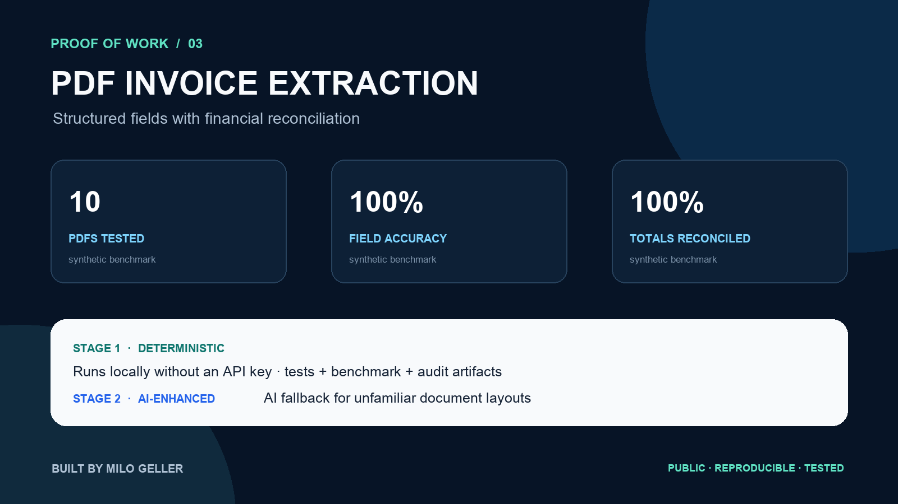

# Validated PDF Invoice Extraction



[](https://github.com/Milo318/invoice-data-extraction-poc/actions/workflows/ci.yml)

A proof of concept that generates realistic sample invoices, extracts structured fields from the PDFs, and validates every financial relationship before accepting the result. An optional AI fallback supports unfamiliar layouts while deterministic reconciliation remains the final control.

> **Data notice:** all vendors, invoice numbers, line items, PDFs, and totals are synthetic mock data. Generated PDFs are visibly labeled as demo documents.

## Proof of work

The [committed benchmark](proof/benchmark.json) compares extracted values with the source-of-truth JSON:

| Check | Measured result |
|---|---:|
| PDFs generated and processed | 10 |
| Scalar fields compared | 80 |
| Field accuracy on generated fixtures | 100% |
| Financial reconciliation | 100% |
| Average extraction time | 2.31 ms/PDF |
| Automated tests | 3 passing |

Reconciliation verifies three independent conditions: quantity × unit price equals each line total, line totals equal the subtotal, and subtotal + tax equals the final total. The benchmark covers a known layout and is not a claim of universal document support.

### Reproduce the evidence

```bash
python3 -m venv .venv
source .venv/bin/activate
python -m pip install -e .
python -m unittest discover -s tests -v
python -m invoice_extractor.cli
python -m invoice_extractor.benchmark
```

The demo generates ten PDFs under `output/pdfs/` and writes normalized invoice JSON to `output/extracted.json`.

## How it works

```text
Synthetic invoice truth data
        ↓
Generated, visibly labeled PDFs
        ↓
PDF text extraction
        ↓
Field and line-item parsing
        ↓
Financial reconciliation
        ↓
Structured JSON or explicit rejection
```

### Stage 1 — deterministic core

Known document layouts use explicit field patterns and decimal arithmetic. Missing required fields fail loudly instead of silently producing incomplete output. The result includes a `reconciled` flag so downstream automation can enforce review rules.

### Stage 2 — usable AI fallback

For an unfamiliar layout, `--ai-fallback` sends the extracted text to an OpenAI-compatible model with a fixed target schema. AI proposes the structure; the implementation then independently validates the response shape and reconciles all line-item arithmetic before returning it.

```bash
export LLM_API_KEY="..."
python -m invoice_extractor.cli --ai-fallback
```

## Evidence map

- [`data/mock/invoices.json`](data/mock/invoices.json) — labeled synthetic source of truth
- [`tests/test_extraction.py`](tests/test_extraction.py) — extraction and reconciliation checks
- [`proof/benchmark.json`](proof/benchmark.json) — field comparison and timing results
- [`proof/portfolio-card.png`](proof/portfolio-card.png) — portfolio-ready evidence image
- [GitHub Actions workflow](.github/workflows/ci.yml) — regenerates PDFs and verifies extraction on every push

## Production extension points

Production work would add OCR for scanned documents, supplier-specific layout adapters, human review, duplicate-invoice detection, currency/tax rules, encrypted storage, and accounting-platform integration.

Built by **Milo Geller** · MIT licensed.
